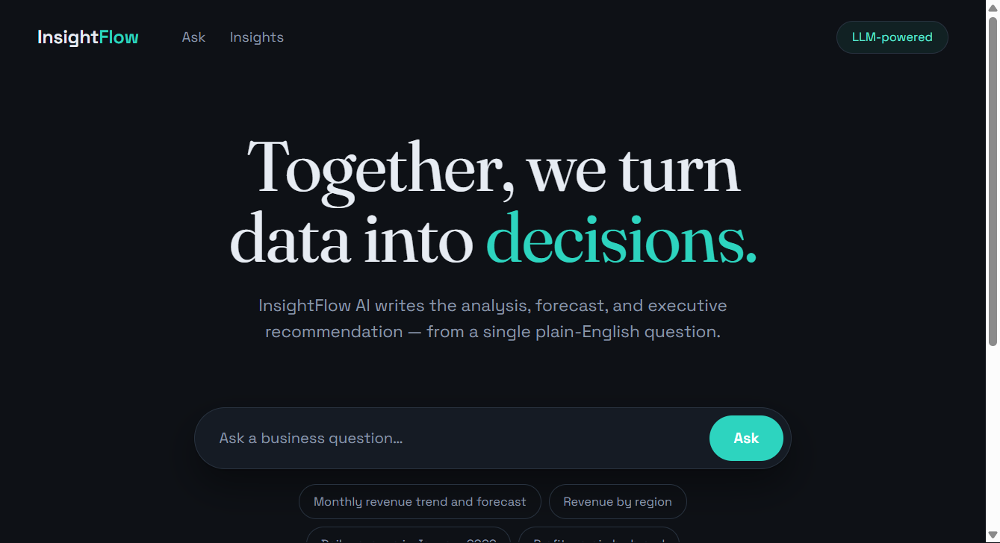
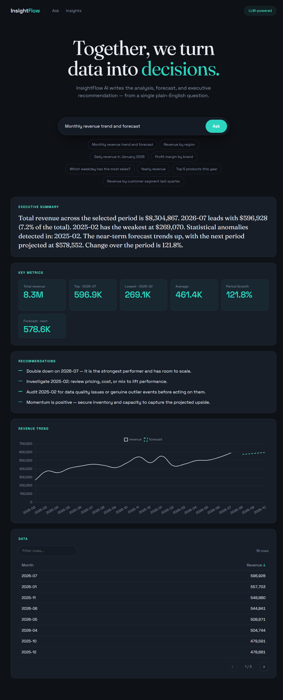
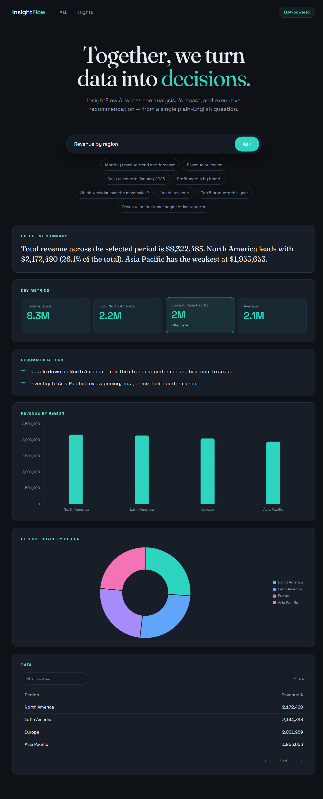
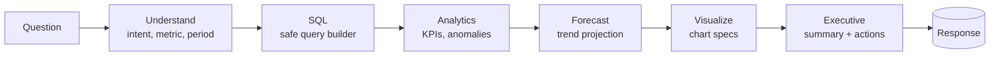
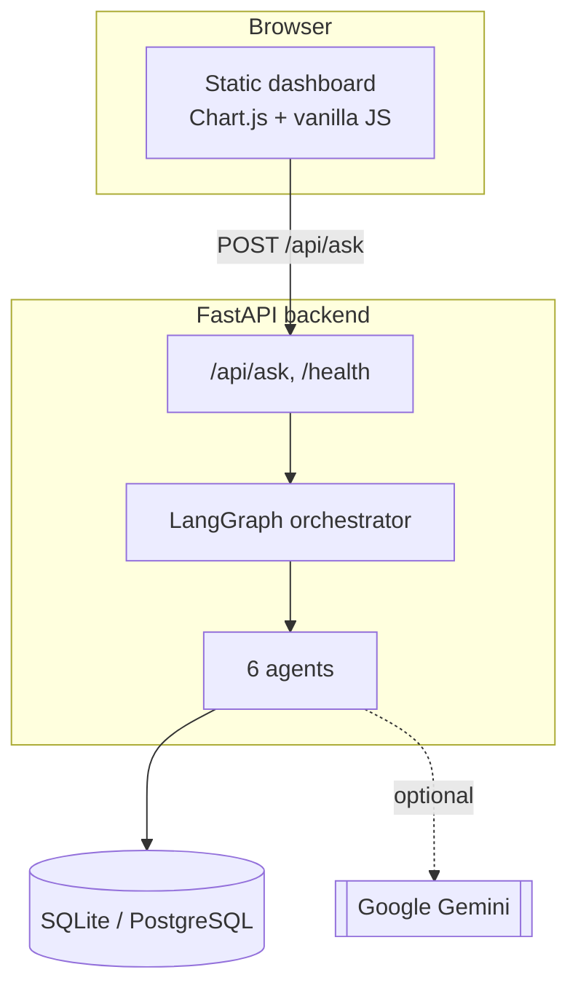

<div align="center">

# InsightFlow AI

### Autonomous Business Intelligence & Executive Intelligence Platform

**Ask a business question in plain English — get an executive-level answer with analysis, forecast, charts, and recommendations.**



</div>

---

## Overview

Most organizations spend a fortune building dashboards — yet executives rarely open them. They ask questions. **InsightFlow AI** turns a single plain-English question into a full executive briefing:

> _"Show me the monthly revenue trend and forecast"_ →
> a written summary, KPI cards, an anomaly call-out, a 3-month forecast, an interactive chart, and concrete recommendations.

A pipeline of autonomous agents understands the question, writes safe SQL, computes KPIs, forecasts trends, builds visualizations, and drafts the executive narrative. It runs **fully offline with deterministic logic**, and automatically upgrades to **Google Gemini** for richer language understanding when an API key is present.

---

## Screenshots

### Trend analysis with forecast
A time-series question produces a summary, KPI strip, recommendations, a trend line with a dashed 3-month forecast, and a paginated data table.



### Categorical breakdown
A "by dimension" question produces a ranked bar chart plus a composition doughnut, with interactive KPI tiles that filter the table.



---

## Key features

- **Natural-language → SQL** — ask in plain English; the system builds a safe, parameterized query (no free-form LLM SQL, so it's injection-safe).
- **Executive summaries & recommendations** — every answer includes a written narrative and concrete, action-oriented advice.
- **Forecasting** — linear-trend projection for monthly/quarterly series, drawn as a dashed forecast line.
- **Anomaly detection** — statistical outliers (z-score) are flagged automatically.
- **Adaptive visualizations** — the chart type follows the question: line (trends), bar (comparisons), horizontal bar (rankings), doughnut (composition).
- **Interactive dashboard** — clickable KPI tiles, a filterable / sortable / paginated data table.
- **Runs with or without an LLM** — deterministic heuristics by default; Gemini-powered when a key is set, with graceful fallback if a call fails.

---

## How it works

A LangGraph pipeline chains six specialized agents:



| Agent | Responsibility |
|-------|----------------|
| **Understand** | Detects metric, grouping dimension, time period, and intent (LLM or heuristic) |
| **SQL** | Builds a parameterized SQLAlchemy query from a whitelist of metrics/dimensions/filters |
| **Analytics** | Totals, top/bottom, concentration, z-score anomalies, period growth |
| **Forecast** | Linear-regression projection for coarse time series (month/quarter) |
| **Visualize** | Emits chart specs (line / bar / hbar / doughnut) based on the question |
| **Executive** | Writes the summary and recommendations (metric-aware formatting) |

> Only **Understand** and **Executive** ever use the LLM. The SQL, analytics, forecast, and visualization steps are **always deterministic** — the model never touches your data or math.

---

## What you can ask

The system understands a wide space of questions — combine any metric × dimension × time filter.

| Category | Examples |
|----------|----------|
| **Metrics** | revenue, profit, units, orders, average order value, **profit margin** |
| **Group by** | region, category, brand, product, customer segment, city |
| **Time series** | year, **fiscal year**, quarter, month, week, day, day-of-week |
| **Specific periods** | "in 2025", "Q1 2026", "January 2026", "FY2026", YTD / MTD / QTD, "last 6 months", "last 30 days" |
| **Rankings** | "top 5 products", "bottom 3 cities", "which weekday is busiest" |
| **Combined** | "profit margin by brand for fiscal year 2026", "daily revenue in January 2026", "top 3 cities by profit in the last 6 months" |

Fiscal years default to a **July–June** calendar (FY2026 = Jul 2025 – Jun 2026) and are configurable.

---

## Architecture



**Tech stack:** FastAPI · LangGraph · SQLAlchemy 2 · Pydantic · Google Gemini (`google-genai`) · Chart.js · vanilla JS (no build step).

---

## Getting started (local)

```powershell
python -m venv .venv
.\.venv\Scripts\Activate.ps1
pip install -r requirements.txt

# Seed the database with demo business data
python -m backend.seed_data

# Run the API (also serves the dashboard)
uvicorn backend.main:app --reload
```

Open **http://127.0.0.1:8000/** for the dashboard, or call the API directly:

```powershell
curl -X POST http://127.0.0.1:8000/api/ask `
  -H "Content-Type: application/json" `
  -d '{"question":"What was our revenue by region last quarter?"}'
```

To enable Gemini-powered reasoning, copy `.env.example` to `.env` and set `GEMINI_API_KEY`.

---

## Configuration

Copy [`.env.example`](.env.example) to `.env` and adjust:

| Variable | Default | Purpose |
|----------|---------|---------|
| `DATABASE_URL` | `sqlite:///./insightflow.db` | Any SQLAlchemy URL (e.g. PostgreSQL) |
| `GEMINI_API_KEY` | _(empty)_ | Enables LLM-powered agents (Google Gemini) |
| `GEMINI_MODEL` | `gemini-2.5-flash-lite` | Primary Gemini model |
| `GEMINI_FALLBACK_MODEL` | `gemini-2.5-flash` | Used automatically if the primary fails |
| `CORS_ORIGINS` | `*` | Comma-separated allowed browser origins |
| `fiscal_year_start_month` | `7` | Month the fiscal year starts (July) |

---

## Deployment (Netlify + Render)

The frontend deploys as a static site on **Netlify**; the API as a web service on **Render**. Netlify proxies `/api/*` and `/health` to Render, so the browser stays same-origin (no CORS issues).

**Backend — Render**
1. Push this repo to GitHub.
2. In Render: **New +** → **Blueprint** → select the repo. It reads [`render.yaml`](render.yaml) and provisions the service.
3. Add the `GEMINI_API_KEY` value in the service's **Environment** tab.
4. Copy the service URL, e.g. `https://insightflow-api.onrender.com`.

The database **auto-seeds on first boot** (Render's free disk is ephemeral, so it re-seeds on each deploy).

**Frontend — Netlify**
1. In [`netlify.toml`](netlify.toml), replace `INSIGHTFLOW_API_URL` with your Render host.
2. In Netlify: **Add new site** → **Import from Git** → select the repo (publish directory `frontend` is preset).
3. Deploy. The site reaches the backend through the Netlify proxy.

> Prefer not to proxy? Set `window.__API_BASE__` to the Render URL in `frontend/index.html` and lock `CORS_ORIGINS` to your Netlify origin.

> **Note:** Render's free tier sleeps after inactivity, so the first request after idle takes ~30–60s to wake (and re-seed).

---

## Project structure

```
backend/
  main.py             FastAPI app, routes, CORS, startup auto-seed
  config.py           Settings from env / .env
  database.py         SQLAlchemy engine & session
  models.py           Sales, Products, Customers, Inventory, Campaigns
  schemas.py          Pydantic request/response models
  seed_data.py        Generates realistic demo data
  llm.py              Gemini abstraction with heuristic fallback
  agents/
    constants.py      Shared time-dimension groupings
    orchestrator.py   LangGraph pipeline wiring
    question_agent.py Intent parsing (LLM + heuristic)
    sql_agent.py      Safe query builder
    analytics_agent.py
    forecast_agent.py
    visualization_agent.py
    executive_agent.py
frontend/
  index.html          Single-page dashboard (Chart.js)
docs/screenshots/     README images
render.yaml           Render blueprint
netlify.toml          Netlify config + API proxy
runtime.txt           Python version pin
```

---

## Notes & limitations

- The bundled demo data spans ~18 months, so some yearly/fiscal-year views are partial by nature — the logic is correct, the dataset is just short.
- SQL is built from a whitelist (not free-form LLM output), keeping it injection-safe.
- Default database is SQLite for zero-setup local runs; point `DATABASE_URL` at PostgreSQL for production.
